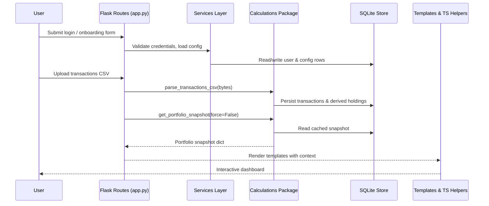

# DashFolio technical structure

DashFolio couples a Flask web application with a calculation engine and a thin
TypeScript utility layer to deliver a disciplined portfolio-monitoring workflow.
This document explains how the pieces fit together so maintainers can reason
about data flow, analytics, and persistence without diving into source code.

## 1. End-to-end journey

1. **User session** – A single authenticated investor signs in through
   `app.py`, which wires registration, login, onboarding, and dashboard routes.
   Session duration, currency, and benchmark preferences are loaded via
   `services/configuration.py`.
2. **Portfolio bootstrap** – Onboarding captures deposits and uploads CSV trade
   history. Normalisation functions in `Calculations/transactions.py` reconcile
   buys, sells, and cash adjustments into canonical holdings and cash balances,
   writing them to SQLite through helpers in `Calculations/storage.py`.
3. **Market enrichment** – The analytics layer pulls historical OHLCV candles
   from Yahoo Finance with `Calculations/price_data.py` and snapshot quotes via
   `Calculations/market_data.py`. Data is cached locally so subsequent refreshes
   are incremental.
4. **Analytics pipeline** – `main.py` orchestrates the calculation loop:
   holdings are priced (`Calculations/portfolio.py`), EWMA statistics are
   computed (`Calculations/statistics.py`), and trailing-stop risk simulations
   are persisted (`Calculations/risk_analysis.py`).
5. **Presentation** – Flask templates in `templates/` render the stored results
   into cards, charts, and tables. Client-side helpers under `portfolio/*.ts`
   format day-over-day gains and time-weighted return indices for the UI.

### Sequence overview



## 2. Module responsibilities

| Component | Role | Key files |
| --- | --- | --- |
| Flask entry point | Registers routes, enforces single-user guards, coordinates onboarding, portfolio, risk, transaction, and settings views. | `app.py` |
| Configuration service | Ensures default `config.json`, applies session lifetime, resolves currency symbols and precision. | `services/configuration.py` |
| Portfolio service | Synchronises JSON holdings with cached state, loads and saves snapshots, and persists rebalancing targets. | `services/portfolio.py` |
| Authentication service | Hashes credentials, stores the single-user record, and manages login/out flags in SQLite. | `services/auth.py` |
| Calculation package | Provides reusable functions for loading config, prices, portfolio holdings, and running analytics. | `Calculations/__init__.py` |
| Transactions pipeline | Parses CSV uploads, normalises tickers and timestamps, derives holdings & cash, and updates SQLite tables. | `Calculations/transactions.py` |
| Market data layer | Downloads OHLCV history, computes EMA bands, and returns structured quote snapshots. | `Calculations/market_data.py` |
| Risk engine | Simulates trailing-stop hit rates, calculates potential loss & EWMA VaR, and stores results. | `Calculations/risk_analysis.py` |
| Front-end utilities | Compute day-change summaries and time-weighted return indices for template rendering and tooltips. | `portfolio/ui.ts`, `portfolio/performanceIndex.ts`, `portfolio/investedSeries.ts` |

## 3. Core data structures

### Configuration (`config.json`)

| Field | Description |
| --- | --- |
| `DATA_PERIOD` | Analysis horizon (e.g., `"YTD"`, `"1y"`, `"custom"`). |
| `CUSTOM_START_DATE` | ISO date used when `DATA_PERIOD` is `custom`. |
| `STOP_LOSS_PERCENTAGE_RANGE` | Tuple/list containing min and max trailing-stop percentages. |
| `STOP_LOSS_STEP` | Increment applied when sweeping stop-loss levels. |
| `NUM_SIMULATIONS` | Monte Carlo draw count per stop-loss scenario. |
| `CONFIDENCE_LEVEL` | Tail probability used for VaR and percentile analysis. |
| `SPAN_EWMA` | Span parameter for exponentially weighted metrics. |
| `BENCHMARK_TICKER` | Symbol representing the comparison index (default `SPY`). |
| `CURRENCY` | ISO currency code used for formatting. |
| `AUTO_REFRESH_INTERVAL` | Front-end polling cadence (seconds). |

### Portfolio payload (`portfolio.json`)

Each holding entry contains:

- `ticker`: Uppercase symbol string.
- `quantity`: Units currently held.
- `average_cost`: Average acquisition price.
- Optional metadata such as `name` and `logo_url`.
- `target_allocations`: percentage weights keyed by ticker.

During price refreshes, the calculation layer writes back `current_price` and
`position` values to keep disk and database snapshots aligned.

### SQLite schema

| Table | Purpose | Essential columns |
| --- | --- | --- |
| `users` | Single authenticated account with hashed password and onboarding flags. | `id`, `username`, `password_hash`, `onboarding_completed` |
| `transactions` | Normalised trade ledger derived from CSV uploads. | `timestamp`, `ticker`, `quantity`, `price`, `commission` |
| `derived_holdings` | Aggregated share counts, cost basis, and last activity per ticker. | `ticker`, `quantity`, `average_cost`, `last_transaction_at` |
| `cash_balances` | Latest reconciled cash total. | `balance` |
| `cash_adjustments` | Deposits, withdrawals, dividends, and interest entries. | `timestamp`, `amount`, `type` |
| `price_data` | Daily OHLCV candles downloaded via Yahoo Finance. | `ticker`, `date`, `Open`, `High`, `Low`, `Close`, `Adj Close`, `Volume` |
| `risk_analysis_results` | Persisted trailing-stop sweeps and VaR outputs keyed by period. | `data_period`, `ticker`, `trailing_stop_pct`, `likelihood_pct`, `potential_loss`, `ewma_var` |
| `portfolio_snapshots` | Cached aggregate views (equity, allocations, benchmark) for rapid dashboard loads. | `cache_key`, `generated_at`, `payload` |
| `performance_history` | Daily portfolio returns and equity for trend charts. | `date`, `equity`, `cash`, `daily_return` |

All persistent artifacts (`config.json`, `portfolio.json`, `dashfolio.db`) reside
in the configurable data root pointed to by the `DASHFOLIO_DATA_DIR` environment
variable. By default the application resolves this to `/mnt/config/dashfolio`,
which should be mounted from the host when running inside Docker.

## 4. Analytics and formulas

The analytics layer relies on exponential weighting to emphasise recent market
behaviour. Let $r_t$ denote the daily return at time $t$,  
$\lambda = \dfrac{2}{\text{SPAN\_EWMA} + 1}$, and $w_i = (1-\lambda)^i$.

- **Daily return**

  ```math
  r_t = \frac{P_t}{P_{t-1}} - 1
  ```

  where $P_t$ is the adjusted close from `Calculations/price_data.py`.

- **EWMA mean** (used for drift in simulations)

  ```math
  \mu_t = \frac{\sum_{i=0}^{n-1} w_i\, r_{t-i}}{\sum_{i=0}^{n-1} w_i}
  ```

- **EWMA volatility**

  ```math
  \sigma_t = \sqrt{\frac{\sum_{i=0}^{n-1} w_i \left(r_{t-i} - \mu_t\right)^2}{\sum_{i=0}^{n-1} w_i}}
  ```

- **Annualised volatility** (reported in `calculate_statistics`)

  ```math
  \sigma_{\text{annual}} = \sigma_t \sqrt{252}
  ```

- **Trailing-stop likelihood**

  ```math
  S_{t+j} = S_t \prod_{k=1}^{j} (1 + \varepsilon_k)
  \quad \text{where} \quad
  \varepsilon_k \sim \mathcal{N}(\mu_t, \sigma_t)
  ```

  Activation probability equals the share of simulations where  
  $S_{t+j} \leq S_t (1 - L/100)$.

- **Potential loss** at stop $L$

  ```math
  \text{Loss} = \bigl(P_t - P_t (1 - L/100)\bigr) \times Q
  ```

  with $Q$ representing the position size.

- **EWMA Value-at-Risk (VaR)** for confidence level $\alpha$

  ```math
  \text{VaR} = z_{1-\alpha} \, \sigma_t \, P_t \, Q
  ```

  where $z$ is the standard normal quantile estimated in  
  `Calculations/risk_analysis.py`.

- **Time-weighted return index** (`portfolio/performanceIndex.ts`)  
  After each external cash-flow day $f$, the index is reset so performance
  reflects only market appreciation:

  ```math
  \text{TWR}_{d_i} = \text{TWR}_{f} \prod_{j=f+1}^{i} (1 + R_j),
  \qquad
  R_j = \frac{V_{d_j} - V_{d_{j-1}}}{V_{d_{j-1}}}
  ```


## 5. Data flow details

1. **Input ingestion** – CSV uploads flow through `parse_transactions_csv`,
   which standardises column names and validates tickers, timestamps, and
   numeric fields. Cash adjustments entered in onboarding use the same
   normalisation helpers to ensure consistent ledger entries.
2. **Holdings derivation** – The transaction ledger is reduced to per-ticker
   aggregates (`compute_holdings_from_transactions`), computing running cost
   basis and linking to market snapshots from `Calculations/market_data.py` for
   last-close metadata.
3. **Snapshot assembly** – `Calculations/snapshot.py` combines derived holdings,
   cached prices, benchmark series, and configuration preferences into a
   serialisable dictionary consumed by templates. Results are cached through
   `Calculations/snapshot_cache.py` keyed by holdings fingerprint plus
   configuration, dramatically reducing load times on repeated visits.
4. **Front-end presentation** – Template macros feed TypeScript helpers:
   `portfolio/ui.ts` formats the day’s gain/loss badges and tooltips, while
   `portfolio/investedSeries.ts` and `portfolio/performanceIndex.ts` construct
   data series for charts and summary cards.

## 6. Visual glossary

| Visual | Meaning |
| --- | --- |
|  | High-level look at the dashboard cards (allocations on the left, charts on the right, performance summary at the bottom). |
|  | Flow of configuration, transaction, and market data between services, the calculations engine, and the SQLite store. |

Together these layers ensure DashFolio delivers reproducible analytics,
transparent data movement, and an approachable dashboard for long-term
investors.
